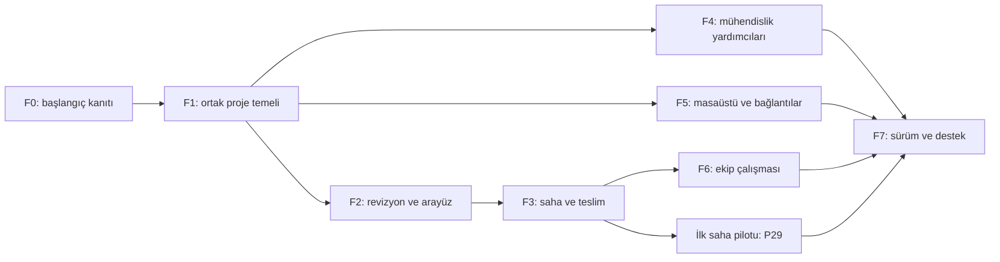

# Rack Studio — ürünleştirme uygulama planı

Tarih: 7 Ekim 2026 · Durum: P17–P21 kaynaklı katalog, fiziksel uyumluluk, PoE/güç, açıklayan denetim ve iki alternatifli senaryo uygulandı; sırada P22 Tauri SQLite repository. Kalan fiziksel kabul kanıtları uygulama kaydında.

## Ürün hedefi

Kabin projesini hazırla, sahada gerçekleşen durumu doğrula, revizyonları karşılaştır ve müşteriye teslim paketini çıkar. İlk kullanıcı grubu teknisyenler, küçük IT ekipleri ve entegratörlerdir. Kurumsal bağlantılar ve ekip çalışması aynı veri temelinin üzerinde ikinci genişleme olarak gelir.

Bu paket konuşmadaki bütün önerileri kapsar. Birbirine bağımlı işleri aşamalara ayırır; ileri aşamadaki bir özelliğin henüz geliştirilmemesi kapsamdan çıkarıldığı anlamına gelmez. Mevcut 2D/3D stüdyo korunarak ilerlenir.

## Nasıl kullanılacak?

1. [Ürün kapsamı ve ekran akışları](01-product-and-ux.md): kullanıcı işleri, kapsam sınırları ve bütün önerilerin karşılıkları.
2. [Mimari ve veri sözleşmesi](02-architecture-and-data.md): ortak proje modeli, kayıt, revizyon, 2D/3D ve geçiş kuralları.
3. [32 uygulanabilir iş paketi](03-work-packages.md): sıra, bağımlılık, dosya sorumluluğu, yapılacak iş ve kabul senaryoları.
4. [Doğrulama, pilot ve sürüm kapıları](04-validation-and-release.md): 44 kabul senaryosu, komutlar, gerçek cihaz ve saha kanıtı.
5. [Teknoloji kararları ve kaynaklar](05-technology-decisions.md): TypeScript, IndexedDB, Tauri/SQLite, NetBox, Jev ve Yjs kararları.

Her paketin tamamlanması kod, ilgili kabul kanıtı ve kısa teslim notu gerektirir. Güncel uygulama ve doğrulama kaydı: [06-implementation-status.md](06-implementation-status.md). Çalışan veri biçimi: [07-project-document-v1.md](07-project-document-v1.md). Teslim merkezi: [18-delivery-reports-bom-labels.md](18-delivery-reports-bom-labels.md). Mühendislik ve senaryolar: [19-engineering-and-scenarios.md](19-engineering-and-scenarios.md). Sıradaki geliştirme paketi **P22**.

## Aşamalar ve çıktılar

Eforlar tek geliştiricinin geliştirme ve doğrulama emeği için ilk tahmindir. Mevcut hata giderme kapsamı, katalog veri toplama ve saha erişimi P00 sonunda yeniden değerlendirilir. Takvim taahhüdü değildir; saha randevuları, hesaplar ve dış servis beklemeleri ayrıca eklenir.

| Aşama | Paketler | İncelenebilir çıktı | Başlama koşulu | Tahmini mühendis-gün |
|---|---|---|---|---:|
| F0 — başlangıç kanıtı | P00–P01 | Aktif uygulama tabanı, test ve veri fixture envanteri | Mevcut checkout | 3–5 |
| F1 — proje temeli | P02–P06 | Ortak belge, işlem kapısı, çoklu proje, kayıpsız 2D/3D | F0 | 12–20 |
| F2 — revizyon ve arayüz | P07–P09 | Revizyon farkı, tasarım/saha/sunum görünümü, ilk kullanım | F1 | 7–12 |
| F3 — saha ve teslim | P10–P16 | Gözlemler, saha adımları, QR, malzeme/etiket/teslim paketi | F1; ekranlar için F2 | 15–25 |
| F4 — mühendislik yardımcıları | P17–P21 | Kaynaklı katalog, modül/PoE kontrolleri, alternatif tasarım | F1; fark ekranları için P07 | 16–28 |
| F5 — masaüstü ve entegrasyonlar | P22–P25 | SQLite masaüstü, paketleme, NetBox içe alma, AI arama pilotu | F1; NetBox için P10, AI için P17 | 15–25 |
| F6 — ekip çalışması | P26–P28 | Firma/proje yetkileri, birlikte çalışma, çevrimdışı çakışma çözümü | Ortak işlemler ve revizyonlar; F3 akışları | 20–35 |
| F7 — saha pilotu ve ürün sürümü | P29–P31 | Pilot kanıtı, sürüm paketi, destek ve veri yaşam döngüsü | Pilot türüne göre ilgili kapılar | 7–12 |

İlk tarayıcı pilotunun yazılım dilimi F0–F3 sonunda hazır olabilir: yaklaşık **37–62 mühendis-gün**. P29 pilot hazırlama/değerlendirme emeği buna ayrıca eklenir; gerçek saha beklemesi takvim hesabına girer. P29 erken uygulanır, sonraki genişlemelerde tekrarlanır. Masaüstü pilotuna P22–P23; kurumsal pilota P26–P28 eklenir. Bütün kapsam, F7 pilot/sürüm emeği dahil yaklaşık **95–162 mühendis-gün** ilk tahminindedir; P00 sonrası yeniden boyutlandırılır.

## Sürüm sınırları

| Hedef | Kapsam | Kullanıcıya verilen söz |
|---|---|---|
| S1 — yerel saha ürünü | P00–P16 + P29–P31 | Birkaç proje, plan/gözlem ayrımı, saha doğrulaması ve tam teslim |
| S2 — profesyonel tek kullanıcı | S1 + P17–P25 + P30–P31 | Kaynaklı teknik denetimler, senaryolar, Windows paketi ve bağlı sistemler |
| S3 — ekip ürünü | S2 + P26–P28 + genişletilmiş P29 | Yetkili paylaşım, birlikte çalışma ve uzlaşılmış revizyon |

Yapay zekâ erişimi veya NetBox hesabı yerel S1 işlerini engellemez. S3'te sunucuya ulaşmayan topoloji değişiklikleri yerel taslak olarak gösterilir; paylaşılan son durum diye sunulmaz.

## Kaynak tabanı ve kanıt sınırı

- İncelenen HEAD: `051e1de`; çalışma ağacında önceden bulunan üretim/ölçüm/görsel dosya değişiklikleri vardır. Bu plan bunları temizleme veya commit etme talimatı vermez.
- Aktif giriş [index.html](../../index.html); modüler 2D kaynakları `js/2d/`, 3D kaynakları `js/src/3d/` ve `js/src/3d-ui/` altındadır. [Test değerlendirmesi](../test-audit.md) ayrı `src/` prototipinin testlerini aktif ürün kanıtından ayırır.
- `js/editor.js` IndexedDB ve sınırlı localStorage kurtarma kullanır. `js/2d/topology-io.js`, snapshotlar ve kayıtlı görünümler de kayıt yollarına sahiptir. F1 bunlara ortak proje kimliği ve belge sözleşmesi getirir.
- `js/2d/snapshot-manager.js` snapshot karşılaştırması şu anda kablo sayısı, toplam uzunluk ve kabinler arası kablo sayısı üzerinden çalışır. P07 nesne/alan bazlı farkı ekler.
- `js/studio-bridge.js` alanları tek tek dönüştürür. Yeni proje, saha ve katalog bilgilerinin taşınması P05'in açık kabul kapsamıdır.
- Graph projesi `C-Users-ufuk_-Documents-antigravity-fearless-einstein`, Tier 2; kayıtlı generation `2026-09-30T17:48:20Z`. Kontrol edilen kaynaklarda `metadata_changed`, HTML'de kısmi parse aralıkları bildirildi. Maddi bulgular güncel kaynak okumasıyla kontrol edildi. Graph tek başına eksiksizlik veya çağrı sayısı kanıtı olarak kullanılmadı.
- İlk plan teslimi dokümantasyondu. Güncel kod ve yerel test kanıtları 06-implementation-status.md içinde; A01–A44 senaryolarının bütününün tamamlandığı iddia edilmez. Paket kurulum/saha ve fiziksel arıza kanıtları ayrıca yürütülür.

## İşletme kuralı

Bir paket için önce kapsam ve veri sözleşmesi sabitlenir; ardından ilgili modül, aktif uygulama testi ve gerçek arayüz akışı birlikte tamamlanır. Başarısız kayıt, bozuk içe aktarma, geçersiz yerleşim veya veri kaybı varsa bağımlı paket kapanmaz. Katalog ve AI sonuçları bilinen bilgi ile belirsiz bilgiyi ayırır. Ayrıntılar doğrulama belgesindedir.

- [08 — Ortak komut kapısı ve geçiş listesi](08-project-commands.md)

- [09 — Yerel proje deposu, kurtarma ve dış yedek](09-project-repository.md)
- [11 — Proje yönetimi ve saha hiyerarşisi](11-project-management.md)
- [12 — Adlandırılmış revizyonlar ve alan bazlı fark](12-project-revisions.md)
- [13 — Çalışma görünümleri ve ortak seçim bilgileri](13-workflow-views.md)
- [14 — İlk kullanım, navigasyon ve kayıtlı sunum](14-onboarding-and-views.md)
- [15 — Gözlem geçmişi ve plan/gözlem farkı](15-field-observations.md)
- [16 — Saha iş akışı ve kanıt ekleri](16-field-workflow-and-evidence.md)
- [17 — QR kimliği ve çevrimdışı saha erişimi](17-field-qr-and-offline.md)
